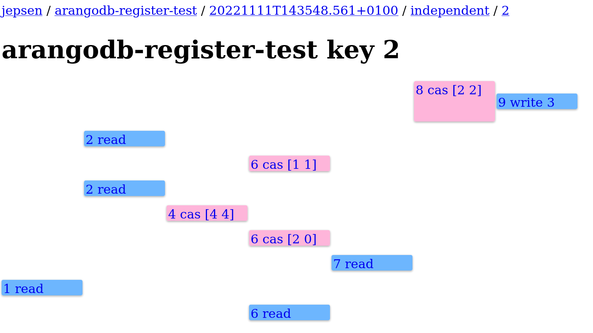
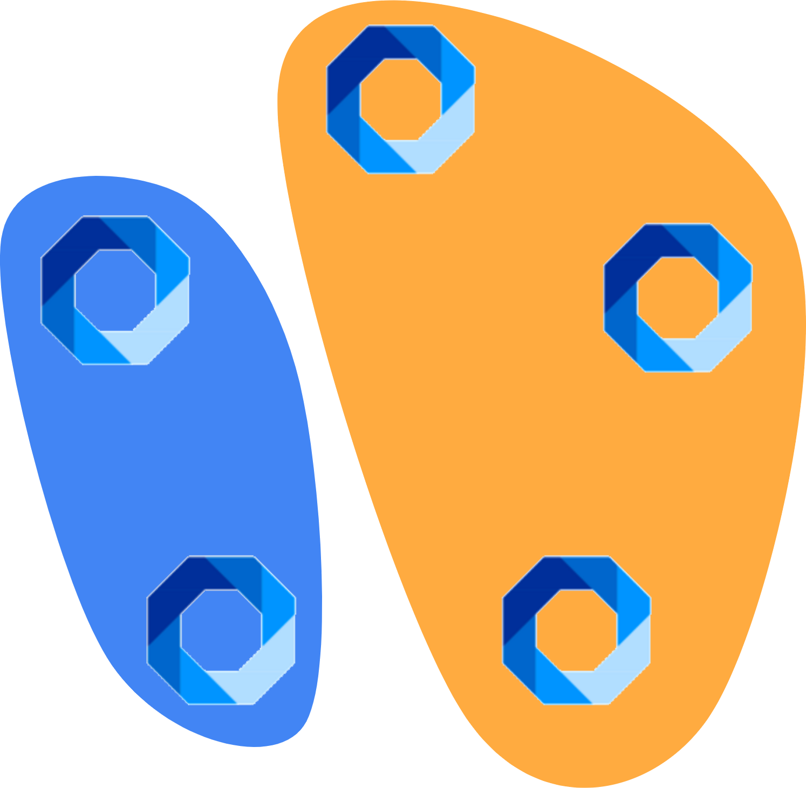

# Register Test of ArangoDB

## Test Setup with an ArangoDB Cluster

An ArangoDB Cluster usually includes three types of node instances: Agents, Coordinators, and DBServers. The Agents store metadata and regulate the whole Cluster with Raft consensus algorithm. The Coordinators receive and transfer the requests to DBServers. Then, DBServers actually handle and process the requests, and store the data.

A quick way to start an ArangoDB cluster by default is to use `arangodb`, namely ArangoDB Starter. This Cluster contains one Agent, one Coordinator and one DBServer on each machine node, and with several nodes it forms a Cluster. To the setting of the Jepsen tests, we start five VM nodes by Vagrant (together with VirtualBox), and run the ArangoDB Starter on each node during the Jepsen pipeline to generate a new Cluster.

## Jepsen: Register Test

### Start a test

To quickly start a register test, use the following command under the project path. This test will allow 20 concurrent threads to run 20 seconds, with 10 operations for each independent key.

```shell
/bin/bash ./run.sh --skip-vagrant --test-type register --time-limit 20 -r 10 --concurrency 20 --ops-per-key 10 --threads-per-group 5 --nemesis-type noop
```

The explanation of each option is as follows.

- `--skip-vagrant`: this flag skips the step of `vagrant up`, especially if the setting follows the instructions in [README](../README.md). This flag is recommended, otherwise stopping and restarting all VMs take a fairly long time.
- `--time-limit` (default 60): the duration of the test (in seconds).
- `-r` (default 10): the operation rate at roughly every dt seconds (dt is a random integer ranging from 0 to 2). For example, rate equal to 10 means that we have about 10 operations within dt seconds for *all* registers.
- `--concurrency` (default 5, should be at least 5): the number of workers (i.e., concurrent threads).
- `--ops-per-key` (default 100): the number of operations for each key. At the beginning of the test, the independent generator splits up a total of `--concurrency` threads into groups of `--threads-per-group` threads. Then all workers of the same group operate on the same key until the number of operations for this key is up. After that, each group of workers receive a new key from the generator and continues to run operations.
- `--threads-per-group` (default 5): the number of threads within each group, split by the independent generator.
- `--nemesis-type` (default `noop`): the nemesis type, `noop` or `partition`. Here `noop` means no fault injection, and `partition` means random network partitions.

### Explanation

The register test is designed to check the linearizability on several independent key-value registers. The first step is to create such registers in the following structure, which makes each pair of the document key and the value of `registerAttr` a key-value store. Here the keys are from the generator (cast to string type for facility), and the values are random integers that range from 0 to 4 (inclusive).

- (db) `registerTest`
  - (collection) `registerCol`
    - (doc_1) {`_key`: *key1*, `registerAttr`: *val1*}
    - (doc_2) {`_key`: *key2*, `registerAttr`: *val2*}
    - ...
    - (doc_n) {`_key`: *keyn*, `registerAttr`: *valn*}

With this data structure, a random generator will generate three types of atomic operations, i.e., read, write and compare-and-swap (cas), on these registers. These operations are implemented in the following way.

- Read: Use Java Driver to directly access the element by `key`. For example, to read the value under the key `"1"`, use `conn.db(DbName.of("registerTest").collection("registerCol").getDocument("1", BaseDocument.class).getAttribute("registerAttr")`.
- Write: Use AQL. An example under the key `"1"` with value 4 is `INSERT {_key: "1", val: 4} INTO registerTest OPTIONS {overwriteMode: "update"}`.
- CAS: Use AQL. An example under the key `"1"` with old value 4 and new value 5 is `FOR d IN registerTest FILTER d._key == "1" AND d.val == 4 UPDATE d WITH {val: 5} IN registerTest RETURN true`.

After running the test suite under multiple independent keys, we can find the results under the subpath `store/arangodb-register-test` of the project path. Within a test folder, we can access the `independent` folder and get the result for each independent key, including the history, result and a timeline. Below is an example of the history and timeline of an independent key.

```
{:type :invoke, :f :cas, :value [2 2], :time 20457473322, :process 8, :index 39}
{:type :invoke, :f :write, :value 3, :time 20459958121, :process 9, :index 41}
{:type :ok, :f :write, :value 3, :time 20462292063, :process 9, :index 42}
{:type :fail, :f :cas, :value [2 2], :time 20465160358, :process 8, :index 43}
{:type :invoke, :f :read, :value nil, :time 20570951333, :process 2, :index 44}
{:type :ok, :f :read, :value 3, :time 20573291142, :process 2, :index 45}
{:type :invoke, :f :cas, :value [1 1], :time 20768867032, :process 6, :index 46}
{:type :fail, :f :cas, :value [1 1], :time 20772610572, :process 6, :index 47}
{:type :invoke, :f :read, :value nil, :time 20932581445, :process 2, :index 48}
{:type :ok, :f :read, :value 3, :time 20935072389, :process 2, :index 49}
{:type :invoke, :f :cas, :value [4 4], :time 21024175097, :process 4, :index 50}
{:type :fail, :f :cas, :value [4 4], :time 21028597701, :process 4, :index 51}
{:type :invoke, :f :cas, :value [2 0], :time 21077177756, :process 6, :index 52}
{:type :fail, :f :cas, :value [2 0], :time 21081303047, :process 6, :index 53}
{:type :invoke, :f :read, :value nil, :time 21205695022, :process 7, :index 54}
{:type :ok, :f :read, :value 3, :time 21209438353, :process 7, :index 55}
{:type :invoke, :f :read, :value nil, :time 21351215259, :process 1, :index 56}
{:type :ok, :f :read, :value 3, :time 21353605842, :process 1, :index 57}
{:type :invoke, :f :read, :value nil, :time 21429969156, :process 6, :index 58}
{:type :ok, :f :read, :value 3, :time 21432516043, :process 6, :index 60}
```



Knossos helps check the linearizability. In the register test, the linearizability is not violated.

## Nemesis: Network Partitioning

With the `partition` value in the argument, the network will be randomly partitioned into two parts every five seconds. An example partition is as the following figure shows, two nodes are grouped into one partition while the other three are the other partition. This nemesis helps check whether the database still performs well when the connections between some nodes are suddenly interrupted.



With this partition, the linearizability is still not violated. However, an interesting finding is that the partitioned cluster **cannot be recovered** after the time limit runs out. A possible reason is that the agency is already stopped so this recovery cannot be technically achieved.

```shell
/bin/bash ./run.sh --skip-vagrant --test-type register --time-limit 20 -r 10 --concurrency 20 --ops-per-key 10 --threads-per-group 5 --nemesis-type partition
```

Below is an example output. The system does not respond after the last timestamp, no more information is output to the console, and the Jepsen test is not ended, either.

```
2022-11-11 15:14:13,020{GMT}	INFO	[jepsen worker 12] jepsen.util: 12	:invoke	:write	[9 3]
2022-11-11 15:14:13,022{GMT}	INFO	[jepsen worker 12] jepsen.util: 12	:ok	:write	[9 3]
2022-11-11 15:14:13,026{GMT}	INFO	[jepsen worker 16] jepsen.util: 16	:invoke	:cas	[8 [1 2]]
2022-11-11 15:14:13,028{GMT}	INFO	[jepsen worker 16] jepsen.util: 16	:fail	:cas	[8 [1 2]]
2022-11-11 15:14:20,037{GMT}	WARN	[jepsen worker 0] jepsen.arangodb.tests.register: AQL: cluster internal HTTP connection broken (while optimizing plan)
2022-11-11 15:14:20,037{GMT}	WARN	[jepsen worker 15] jepsen.arangodb.tests.register: AQL: cluster internal HTTP connection broken (while optimizing plan)
2022-11-11 15:14:20,037{GMT}	WARN	[jepsen worker 5] jepsen.arangodb.tests.register: AQL: cluster internal HTTP connection broken (while optimizing plan)
2022-11-11 15:14:20,037{GMT}	INFO	[jepsen worker 0] jepsen.util: 0	:fail	:cas	[6 [0 1]]	:conn-closed
2022-11-11 15:14:20,037{GMT}	INFO	[jepsen worker 15] jepsen.util: 15	:fail	:cas	[7 [2 2]]	:conn-closed
2022-11-11 15:14:20,037{GMT}	INFO	[jepsen worker 5] jepsen.util: 5	:fail	:cas	[4 [0 3]]	:conn-closed
2022-11-11 15:14:22,025{GMT}	WARN	[jepsen worker 3] jepsen.arangodb.tests.register: AQL: cluster internal HTTP connection broken (while optimizing plan)
2022-11-11 15:14:22,025{GMT}	WARN	[jepsen worker 13] jepsen.arangodb.tests.register: AQL: cluster internal HTTP connection broken (while optimizing plan)
2022-11-11 15:14:22,025{GMT}	INFO	[jepsen worker 3] jepsen.util: 3	:fail	:cas	[6 [3 3]]	:conn-closed
2022-11-11 15:14:22,025{GMT}	WARN	[jepsen worker 8] jepsen.arangodb.tests.register: AQL: cluster internal HTTP connection broken (while optimizing plan)
2022-11-11 15:14:22,025{GMT}	INFO	[jepsen worker 13] jepsen.util: 13	:fail	:cas	[5 [0 0]]	:conn-closed
2022-11-11 15:14:22,025{GMT}	INFO	[jepsen worker 8] jepsen.util: 8	:fail	:cas	[4 [3 3]]	:conn-closed
2022-11-11 15:16:10,027{GMT}	WARN	[jepsen worker 18] jepsen.arangodb.tests.register: cluster internal HTTP connection broken
2022-11-11 15:16:10,027{GMT}	INFO	[jepsen worker 18] jepsen.util: 18	:fail	:read	[7 nil]	:conn-closed
2022-11-11 15:16:11,175{GMT}	WARN	[jepsen worker 4] jepsen.arangodb.tests.register: cluster internal HTTP connection broken
2022-11-11 15:16:11,175{GMT}	WARN	[jepsen worker 9] jepsen.arangodb.tests.register: cluster internal HTTP connection broken
2022-11-11 15:16:11,175{GMT}	INFO	[jepsen worker 4] jepsen.util: 4	:fail	:read	[6 nil]	:conn-closed
2022-11-11 15:16:11,175{GMT}	INFO	[jepsen worker 9] jepsen.util: 9	:fail	:read	[4 nil]	:conn-closed
```

We add a `timeout` when creating the ArangoDB builder as a temporary workaround to solve this issue. Below is the equivalent Java code.

```java
ArangoDB arangoDB = new ArangoDB.Builder().host(node, 8529).user("root").password("").timeout(10000).build();
```

Here we assign a timeout of 10s to break down the system when any request remains idle for 10 seconds. This is still not an ideal way, since the output signifies some internal errors meaning that the internal system does not handle this in a better way.

```
ERROR [2022-11-11 15:42:58,969] pool-14-thread-1 - com.arangodb.internal.velocystream.internal.MessageStore Reached the end of the stream.
java.io.IOException: Reached the end of the stream.
        at com.arangodb.internal.velocystream.internal.VstConnection.readBytesIntoBuffer(VstConnection.java:348)
        at com.arangodb.internal.velocystream.internal.VstConnection.readBytes(VstConnection.java:340)
        at com.arangodb.internal.velocystream.internal.VstConnection.readChunk(VstConnection.java:315)
        at com.arangodb.internal.velocystream.internal.VstConnection.lambda$open$0(VstConnection.java:212)
        at java.base/java.util.concurrent.FutureTask.run(FutureTask.java:264)
        at java.base/java.util.concurrent.ThreadPoolExecutor.runWorker(ThreadPoolExecutor.java:1128)
        at java.base/java.util.concurrent.ThreadPoolExecutor$Worker.run(ThreadPoolExecutor.java:628)
        at java.base/java.lang.Thread.run(Thread.java:829)
```

## Conclusion

In the register test setting, ArangoDB does not violate linearizability in terms of atomic operations (read, write and cas) with or without partition. However, ArangoDB cluster seems not be able to stop correctly in the partition setting of Jepsen. The reason remains unknown but a possible one might be that the agency is stopped early.

This test is part of the work for my master's thesis at TU Delft. More tests are on the way and more properties/anomalies are to be found.
