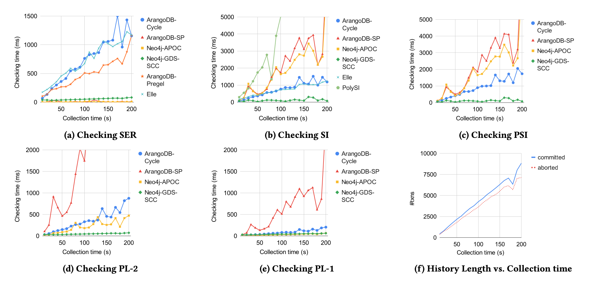

# *fig-list* [DS1]: Runtime for checking anomalies in the increasing collection time of execution histories with list variables

The figure below presents the scalability of our graph-based checkers with increasing history length on list variables (dataset DS1) for checking serializability (SER), snapshot isolation (SI), parallel snapshot isolation (PSI), PL-2, and PL-1.

We used the ArangoDB-Cycle, ArangoDB-SP, ArangoDB-Pregel, Neo4j-APOC, and Neo4j-GDS-SCC checkers to detect violations to each isolation level. For ArangoDB-Cycle, we used a cycle-length bound value of $d$ = 4, which is sufficient to detect long-fork anti-patterns having a cycle of size 4 and could also detect all violating histories to all isolation levels in our dataset. The plots in Figures (b)-(e) omit the results for ArangoDB-Pregel since it can only check for serializability violations.

Figure (a) shows the evolution of the checking time (ms) for SER with increasing collection time. Among all checkers, ArangoDB- Cycle demonstrates the highest increase in analysis time. This is due to the fact that the ArangoDB-Cycle checker traverses the graph to find all cycles with a polynomial complexity in the size of the graph. Similarly, the ArangoDB-Pregel checker exhibits polynomial behavior for our datasets, as it runs BSP superstep computations to search for SCCs with a linear cost for each step. In contrast, the shortest-path based checkers ArangoDB-SP and Neo4j-APOC have low analysis times with insignificant increases in history length. This is because they search for the shortest paths between the ver- tices and return when they find a cycle without traversing to detect all the cycles. Neo4j-GDS-SCC, which is based on a performant SCC implementation in the Neo4j library, also has low analysis runtime and scales well with increasing history length.

For checking SI and PSI (Figures (b) and (c)), while the performance trends of ArangoDB-Cycle and Neo4j-GDS-SCC are sim- ilar to that of checking SER, we observe differences in the per- formances of the shortest-path-based checkers ArangoDB-SP and Neo4j-APOC. These require more analysis time for checking SI and PSI than for checking SER. This can be explained by the small number of long-fork and lost-update anomalies in the histories. Unlike the SER violations that could easily be found by the shortest path checkers, the violations to SI and PSI are harder to find, causing the shortest-path based checkers to perform more graph traversals, instead of quickly returning the anti-pattern.

For checking PL-1 and PL-2, ArangoDB-SP shows a significant performance degradation, but the Neo4j-APOC checker remains efficient and scalable. This is because the execution of the Neo4j-APOC queries combines shortest-path detection with filtering, which makes the checker return faster when it finds an anti-pattern. Moreover, the analyses for PL-2 and PL-1 have fewer edges under traversal than SI and PSI since the analyses of their anti-patterns do not require RW edges. However, ArangoDB queries do not currently combine filtering. Therefore, ArangoDB-SP applies filtering only after it computes the shortest paths between vertices. Our histories do not have any violations to the lower isolation levels PL-1 and PL-2, which require the complete exploration of the shortest paths between the transaction vertices in the dependency graphs.

In addition, we observed that the presence of the network partition faults in the test executions did not result in producing more anti-patterns in the ArangoDB histories in our datasets. In general, during the periods when the fault-injector takes effects, it reduces the history length without otherwise affecting the dependency graphs. This can be different for the executions collected by other distributed databases which guarantee strong isolation in the cluster setting. Since ArangoDB does not guarantee serializability, its execution histories exhibit anomalies disallowed by serializability without introducing any network faults.
