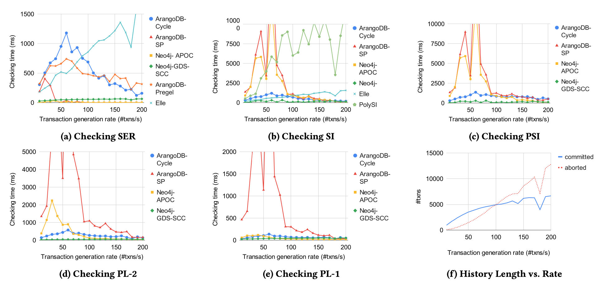
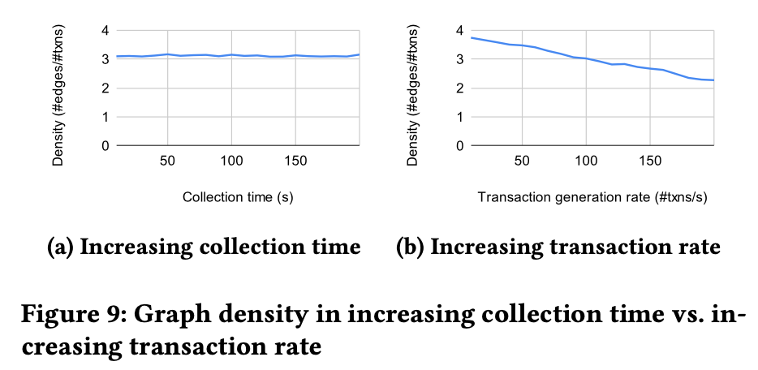

# *fig-rate* [DS3]: Runtime for checking anomalies in the increasing collection time of execution histories with list variables

The figure below presents the scalability of the checkers for SER, SI, PSI, PL-2, and PL-1, when increasing the generation rate of transactions operating on list variables (dataset DS3).

Overall, the relative performance trends of the ArangoDB-Cycle, ArangoDB-Pregel, ArangoDB-SP, Neo4J-APOC, and Neo4J-GDS-SCC checkers are similar to those they exhibit with increasing history length. That is, when there are violations in the execution history, ArangoDB-Cycle requires more analysis time than shortest-path and SCC-based checkers since it traverses the graph for each vertex to detect cycles in the histories. The performance of the ArangoDB-SP and Neo4J-APOC shortest-path based checkers degrade for the execution histories with no violations since they analyze the shortest paths between all vertices in that case. The SCC-based checker Neo4J-GDS-SCC remains performant for checking all isolation levels.

In contrast to the scalability analysis on increasing history length, a significant difference is that the required analysis time does not increase in the increasing rate of transaction generation. Instead, increasing the transaction generation rate to 80 txns/s or higher decreases the analysis time for the graph-based checkers.

Our analysis shows that the decrease in the analysis time is caused by the decreasing density of dependence graphs for the increasing rate of transaction generation. As we generate a higher number of transactions to run concurrently with each other, a higher number of transactions abort due to conflicts with the others. Figures 9a and 9b show the graph density for the test executions with increasing history collection time and increasing the rate of transaction generation, respectively. While the density of the edge-vertex ratio in the dependence graph does not change for the increasing collection time, it monotonically decreases with the increasing transaction generation rate.