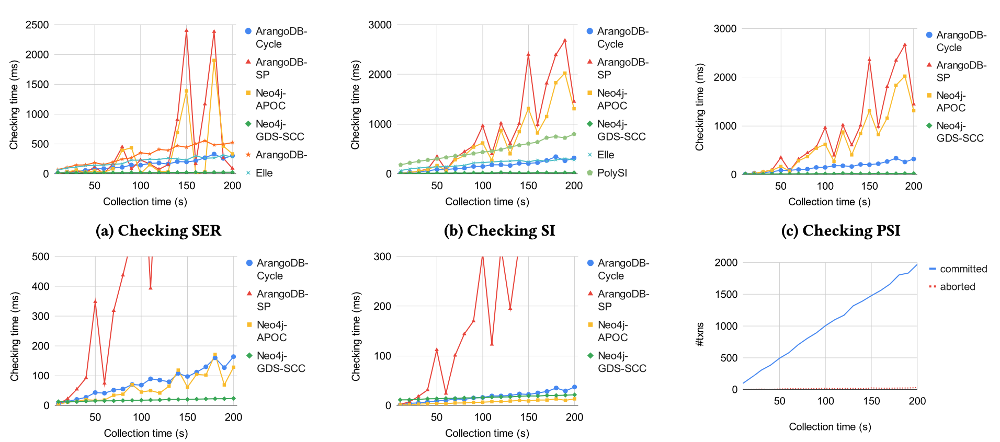

# *fig-reg* [DS6]: Runtime for checking anomalies in the increasing collection time of execution histories with register variables

The figure below shows the scalability of the isolation checkers for SER, SI, PSI, PL-2, and PL-1, with increasing history length, on register variables (dataset DS6).

While the trends in the performances of the graph-based checkers in *fig-list* are similar to the observations in *fig-reg*, there are some significant differences in the analysis time for checking serializability. The shortest-path-based checkers ArangoDB-SP and Neo4j-APOC, which have a low analysis time for checking SER the first dataset (*fig-list*), need a significantly higher analysis time for checking some histories in the second dataset (*fig-list*). This is because the second dataset includes execution histories that do not violate SER, which requires completely exploring shortest paths.

Overall, the performances of the checkers are not affected by using list or register variables in the histories, but by whether the histories have violations pertaining to certain anti-patterns.
